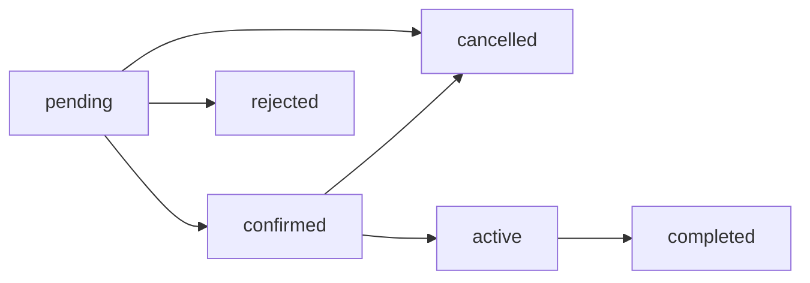
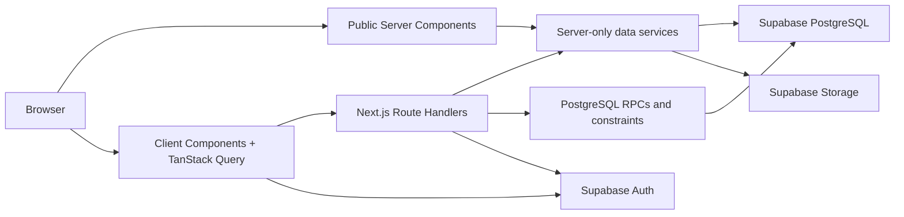
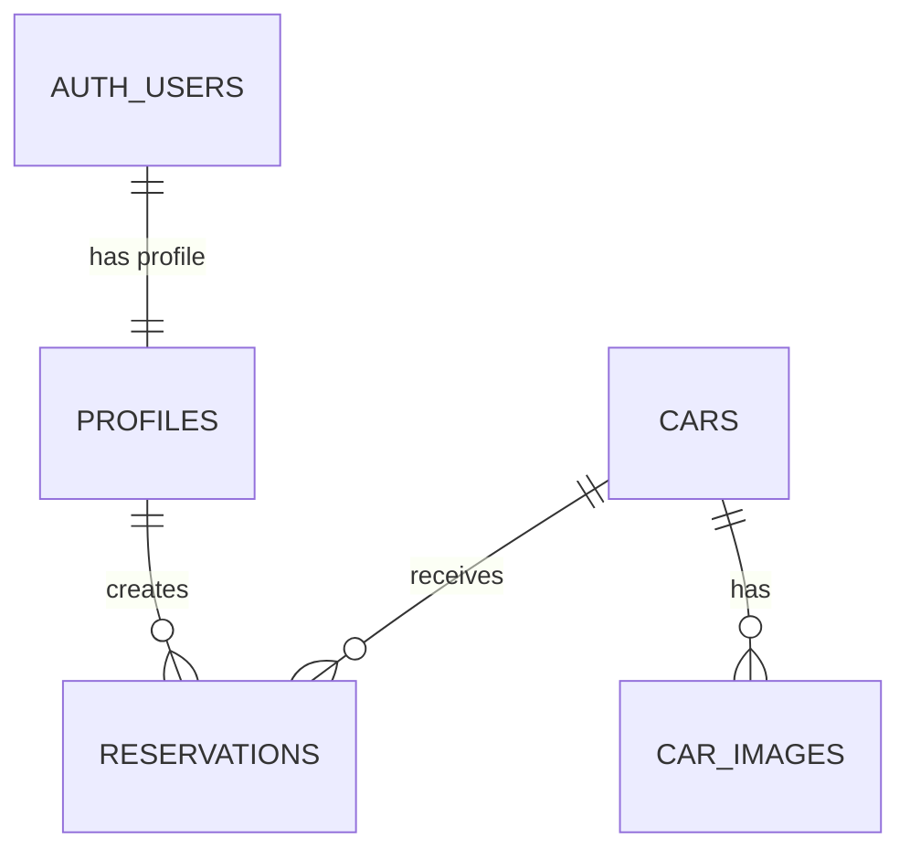

# DriveReserve

A full-stack car rental and reservation platform built with Next.js and Supabase for public vehicle discovery, customer bookings, and fleet administration.

## Table of Contents

- [Project Overview](#project-overview)
- [Screenshots](#screenshots)
- [Features](#features)
  - [Public Experience](#public-experience)
  - [Authentication](#authentication)
  - [Customer Features](#customer-features)
  - [Admin Features](#admin-features)
- [Reservation Lifecycle](#reservation-lifecycle)
- [Business Rules](#business-rules)
- [Technology Stack](#technology-stack)
- [Architecture](#architecture)
- [Rendering Strategy](#rendering-strategy)
- [Project Structure](#project-structure)
- [Routes](#routes)
- [Database Overview](#database-overview)
- [Security](#security)
- [Realtime Status](#realtime-status)
- [Getting Started](#getting-started)
  - [Prerequisites](#prerequisites)
  - [Installation](#installation)
  - [Environment Variables](#environment-variables)
  - [Supabase Setup](#supabase-setup)
  - [Running the Application](#running-the-application)
- [Available Scripts](#available-scripts)
- [Testing and Validation](#testing-and-validation)
- [Development Workflow](#development-workflow)
- [Team](#team)
- [Roadmap](#roadmap)
- [Licence](#licence)

## Project Overview

DriveReserve centralizes vehicle discovery and reservation operations for a car-rental business. Visitors can explore the available fleet and check date availability. Authenticated customers can create and track reservations, maintain their profile, and cancel eligible bookings. Administrators receive a separate operational workspace for cars, reservations, customers, revenue indicators, and fleet status.

A typical booking starts with catalogue filtering, continues through vehicle details and an availability-aware price preview, and is submitted as a `pending` reservation. An administrator can then confirm or reject it, progress an approved rental through its active period, and complete it after return.

## Screenshots

> Add screenshots of the landing page, vehicle catalogue, reservation flow, customer area, and admin dashboard here. The repository currently contains branding assets, but no application screenshots or deployed preview URL.

## Features

### Public Experience

- Responsive landing page with hero search, vehicle categories, featured cars, process overview, benefits, and call-to-action sections.
- Public catalogue limited to cars whose fleet status is `available`.
- Search by brand, model, or category.
- Filters for category, transmission, fuel type, seat count, and maximum daily price.
- Sorting by price, creation date, model year, or brand; six-item pagination; and grid/list layouts encoded in the URL.
- Vehicle details with an ordered image gallery, specifications, description, feature list, and related-vehicle recommendations.
- Availability calendar backed by blocking reservation ranges.
- Server-validated reservation preview with rental duration and snapshot pricing before submission.

### Authentication

- Email/password registration with full name and optional phone number.
- Email-confirmation callback flow and verified-email handling. Confirmation must also be enabled in the target Supabase project's Auth settings; the checked-in local configuration currently disables mandatory email confirmation.
- Email/password login, logout, session refresh, and role-aware redirects.
- Google OAuth initialization and callback routes.
- Password recovery, recovery-session exchange, and password reset.
- Safe internal redirect validation for post-authentication destinations.
- Guest-only authentication pages and protected customer/admin routes enforced through Next.js Proxy and server-side access checks.
- `customer` and `admin` authorization based on a custom `user_role` JWT claim.

### Customer Features

- Browse vehicles and review live price and date availability before booking.
- Create reservations through a controlled PostgreSQL RPC.
- Reservation history with search and status filters.
- Reservation details with vehicle, itinerary, price breakdown, customer details, status progress, and recorded rejection/cancellation reasons.
- Cancel owned `pending` or `confirmed` reservations with a required reason.
- Profile editing for full name and phone number; the email address remains read-only.
- Account statistics for total, active, and completed rentals.
- Account activity details, email-verification state, password-reset access, and logout.

Google profile images are not stored or displayed; customer avatars currently use the account name's initial.

### Admin Features

- Dashboard KPIs for total cars, active and pending reservations, customers, and revenue from completed reservations.
- Six-month revenue and reservation charts, fleet-status visualization, recent reservations, and recent customers.
- Reservation search, status/date filtering, sorting, pagination, summary cards, detail views, and validated status actions.
- Fleet catalogue search, filters, sorting, pagination, create/edit forms, status management, and soft deactivation.
- Car image upload, primary-image selection, and image deletion through the `car-images` Storage bucket. Uploads accept JPEG, PNG, or WebP files up to 5 MB, with up to six files per request.
- Customer directory with search, join-date filters, pagination, operational summaries, and customer detail pages containing statistics and reservation groupings.

Customer records are currently view-only in the admin interface; there are no admin routes for editing or deleting customers.

## Reservation Lifecycle



| Status | Meaning |
| --- | --- |
| `pending` | The customer submitted a request and it is awaiting review. |
| `confirmed` | An administrator approved the booking for its pickup date. |
| `active` | The vehicle has entered its rental period. |
| `completed` | The rental has reached its final successful state. |
| `rejected` | The pending request was declined; a rejection reason is required. |
| `cancelled` | The customer or an administrator cancelled an eligible booking; a cancellation reason is required. |

Terminal statuses (`completed`, `rejected`, and `cancelled`) cannot transition again. PostgreSQL triggers enforce the state machine even if an application caller attempts an unsupported update.

Two trusted maintenance functions are present in the migrations:

- `reject_expired_pending_reservations()` rejects a pending request after 48 hours or when its pickup date begins in Beirut, whichever happens first.
- `advance_reservation_statuses()` moves due `confirmed` reservations to `active` and due `active` reservations to `completed`.

The repository does **not** configure `pg_cron`, an Edge Function schedule, or another job runner. These functions do nothing automatically until a trusted scheduler is configured to invoke them.

## Business Rules

Reservation rules are duplicated at suitable application boundaries for useful feedback, while PostgreSQL functions, constraints, and triggers provide the final integrity checks.

| Rule | Enforcement |
| --- | --- |
| Pickup must be after the current day in `Asia/Beirut`; same-day pickup is not accepted. | Zod validation and PostgreSQL RPCs |
| Return must be later than pickup. | Zod, RPC validation, and a table check constraint |
| A rental can span at most 30 days. | Zod and PostgreSQL RPCs |
| Pickup can be booked at most 180 days ahead. | Zod and PostgreSQL RPCs |
| A customer can hold at most five upcoming `pending`, `confirmed`, or `active` reservations. | `create_reservation()` |
| A customer can have at most two such reservations covering any individual rental day. | `create_reservation()` |
| One car cannot have overlapping `pending`, `confirmed`, or `active` reservations. | Availability checks plus a partial GiST exclusion constraint over a generated `daterange` |
| Only `pending`, `confirmed`, and `active` reservations block availability. | Availability, preview, calendar, and exclusion-constraint logic |
| Only the reservation owner can cancel, and only while status is `pending` or `confirmed`. | `cancel_my_reservation()` with row locking |
| Rejections and cancellations require a nonblank reason. | Zod and the lifecycle trigger |
| Reservation prices do not change when the car's current rate changes. | Stored daily-price snapshot and generated subtotal/total columns |

Creation requests lock the customer's profile row with `FOR UPDATE` so simultaneous requests cannot bypass usage limits. Cancellation and admin status updates lock the reservation row before mutation. The exclusion constraint remains the final race-condition guard for vehicle overlap.

## Technology Stack

Versions below reflect the current `package.json` and npm lockfile.

| Area | Technology |
| --- | --- |
| Framework | Next.js 16.2.12, App Router, React Server Components, Route Handlers, Proxy |
| Language | TypeScript 5 in strict mode |
| UI | React 19.2.4, Tailwind CSS 4, shadcn/ui, Base UI |
| Database | Supabase PostgreSQL 17 for the local CLI stack |
| Authentication | Supabase Auth with `@supabase/ssr` 0.12.3 |
| Storage | Supabase Storage |
| Client data | TanStack Query 5.101.2 |
| Forms | React Hook Form 7.82.0 with Hookform resolvers |
| Validation | Zod 4.4.3 |
| Dates | date-fns 4.4.0 and React DayPicker 10.0.1 |
| Charts | Recharts 3.8.0 |
| Icons | Lucide React 1.25.0 |
| Notifications | Sonner 2.0.7 |
| Theming | next-themes 0.4.6 |

## Architecture

DriveReserve uses separate data paths for server-rendered public content and interactive authenticated workspaces:

- Public catalogue and vehicle-detail Server Components call `server-only` Supabase data functions directly rather than calling the application's HTTP API.
- Interactive customer and admin screens use TanStack Query services that call Next.js Route Handlers.
- Route Handlers validate inputs, verify the authenticated role, and then use server-side Supabase queries or controlled PostgreSQL RPCs.
- The admin edit-car page is a deliberate hybrid: its Server Component loads initial car data directly, while subsequent form and image mutations use Route Handlers.
- Browser Supabase clients are used for Auth state and password-reset operations, not for direct protected-table access.
- Database RLS, RPC authorization, triggers, checks, and the overlap exclusion constraint remain authoritative.



## Rendering Strategy

The application uses a mixed App Router strategy:

- **Statically prerendered shells:** the production build prerenders `/`, the four authentication pages, `/admin`, `/admin/cars`, `/admin/cars/new`, `/admin/customers`, and `/admin/reservations`. The admin routes in this group are protected client-rendered shells rather than public static data. Interactive forms, URL-query handling, navbar session state, and the featured-car section hydrate as Client Components; featured cars are fetched in the browser from `/api/cars/featured`.
- **Dynamic server rendering:** `/cars`, vehicle details, reservation confirmation, all customer pages, and parameterized admin detail/edit pages render on demand. The public data routes read search parameters or query Supabase through a cookie-aware server client, while the customer layout performs a request-time role check. Suspense boundaries stream catalogue results, filters, recommendations, and reservation previews.
- **Client-side data rendering:** customer workspaces and most admin page content use TanStack Query and Route Handlers after the page shell loads. Mutations invalidate the relevant query keys before the UI refetches.
- **Hybrid protection:** Next.js Proxy refreshes Supabase sessions and performs route-level redirects. Customer layouts repeat the role check on the server, while protected API handlers independently enforce authentication and authorization.

There is no explicit `generateStaticParams`, ISR `revalidate` setting, `force-static` route configuration, or Cache Components flag. A Server Component alone therefore should not be interpreted as proof of SSG; request APIs and database access determine whether a route is rendered at request time.

## Project Structure

```text
app/
├── (auth)/                 # Guest authentication and password flows
├── (customer)/             # Protected profile and reservation pages
├── (public)/               # Landing page, catalogue, details, confirmation
├── admin/                  # Protected admin dashboard and management pages
└── api/                    # Auth, public, customer, and admin Route Handlers

components/
├── admin/                  # Dashboard, fleet, reservation, customer UI
├── auth/ and forms/        # Authentication layouts and forms
├── car-details/ and cars/  # Catalogue, details, gallery, availability UI
├── home/                   # Landing-page sections
├── profile/                # Customer profile and account UI
├── reservation/            # Confirmation, history, detail, status UI
└── ui/                     # Reusable shadcn/ui primitives

features/
├── admin/                  # Admin query keys, hooks, services, schemas/types
├── auth/                   # Authentication hooks
├── customer/               # Customer query keys, hooks, services, schemas
└── reservations/           # Shared preview query flow

lib/
├── cars/ and reservations/ # Shared domain rules and date utilities
├── server/                 # Server-only auth and data-access functions
├── supabase/               # Browser, server, admin, and Proxy clients
└── validations/            # Zod request and query validation

supabase/
├── migrations/             # Ordered schema, security, and RPC migrations
├── config.toml             # Local Supabase CLI configuration
└── seed.sql                # Development fleet seed data

types/                      # Generated database types and domain aliases
```

Route groups in parentheses organize the code without changing the public URL. The `features/` directory owns client-side data contracts and query behavior, while `lib/server/` keeps database reads out of the browser bundle.

## Routes

### Page routes

| Route | Access | Purpose |
| --- | --- | --- |
| `/` | Public | Landing page |
| `/cars` | Public | Search, filter, sort, and paginate available vehicles |
| `/cars/[id]` | Public | Vehicle details, gallery, availability, and related cars |
| `/login` | Guest only | Email/password and Google sign-in |
| `/register` | Guest only | Customer account registration |
| `/forgot-password` | Guest only | Request a password-reset email |
| `/reset-password` | Public auth flow | Set a new password from a recovery session |
| `/cars/[id]/confirm-reservation` | Customer | Review dates and price, then submit a reservation |
| `/profile` | Customer | View and edit account details and rental statistics |
| `/my-reservations` | Customer | Search and filter reservation history |
| `/my-reservations/[id]` | Customer | View one owned reservation and cancel it when eligible |
| `/admin` | Admin | Operational dashboard |
| `/admin/cars` | Admin | Fleet catalogue management |
| `/admin/cars/new` | Admin | Create a car and upload its initial images |
| `/admin/cars/[id]/edit` | Admin | Edit a car and manage its image gallery |
| `/admin/reservations` | Admin | Reservation queue, filters, and status actions |
| `/admin/reservations/[reservationId]` | Admin | Reservation details and status actions |
| `/admin/customers` | Admin | Customer directory and summaries |
| `/admin/customers/[customerId]` | Admin | Customer profile, statistics, and reservations |

### API routes

| Route | Methods | Access and purpose |
| --- | --- | --- |
| `/api/auth/register`, `/api/auth/login`, `/api/auth/logout` | `POST` | Account registration and session lifecycle |
| `/api/auth/google`, `/api/auth/callback` | `GET` | Google OAuth initiation and code exchange |
| `/api/auth/confirm`, `/api/auth/recovery` | `GET` | Email confirmation and password-recovery session exchange |
| `/api/auth/forgot-password` | `POST` | Send a recovery email |
| `/api/auth/reset-password` | `PATCH` | Update the current recovery session's password |
| `/api/auth/me` | `GET`, `PATCH` | Read the current account and update a customer profile |
| `/api/cars/featured` | `GET` | Return featured available cars |
| `/api/cars/[id]/unavailable-ranges` | `GET` | Return blocking calendar ranges, including ownership hints |
| `/api/reservations/preview` | `POST` | Public, validated availability and price preview |
| `/api/reservations` | `POST` | Authenticated customer reservation creation |
| `/api/customer/profile` | `GET`, `PATCH` | Customer profile read/update |
| `/api/customer/profile/stats` | `GET` | Customer rental statistics |
| `/api/customer/reservations` | `GET` | Current customer's reservation list |
| `/api/customer/reservations/[reservationId]` | `GET` | One owned reservation |
| `/api/customer/reservations/[reservationId]/cancel` | `PATCH` | Cancel an eligible owned reservation |
| `/api/admin/dashboard` | `GET` | Admin KPIs, charts, and recent activity |
| `/api/admin/cars` | `GET`, `POST` | Admin fleet list and car creation |
| `/api/admin/cars/[id]` | `GET`, `PATCH`, `DELETE` | Admin car read/update and soft deactivation |
| `/api/admin/cars/[id]/images` | `POST`, `PATCH`, `DELETE` | Upload, set primary, and remove car images |
| `/api/admin/reservations` | `GET` | Admin reservation list and summary |
| `/api/admin/reservations/[reservationId]` | `GET` | Admin reservation details |
| `/api/admin/reservations/[reservationId]/status` | `PATCH` | Validated admin status transition |
| `/api/admin/customers` | `GET` | Admin customer list and summary |
| `/api/admin/customers/[customerId]` | `GET` | Admin customer details |

## Database Overview

| Entity | Responsibility |
| --- | --- |
| `auth.users` | Supabase-managed identity, credentials, provider identities, email, and verification state |
| `profiles` | One application profile per Auth user with name, phone, role, and timestamps |
| `cars` | Fleet details, operational status, price, specifications, description, and feature array |
| `car_images` | Ordered Storage object paths with one optional primary image per car |
| `reservations` | Customer/car link, rental dates, generated booking range and duration, price snapshot, generated totals, status, and reasons |



Important database functions include reservation availability and preview helpers, controlled create/cancel/admin-status RPCs, a custom access-token hook, calendar-range lookup, and the two trusted lifecycle maintenance functions described above. The local CLI configuration applies all files in `supabase/migrations/` and then loads `supabase/seed.sql` during `supabase db reset`.

The seed is idempotent for its demo fleet records. Its image rows reference expected Storage paths such as `cars/car-01.jpg`; the corresponding binary image files are not part of this repository and must be uploaded separately or replaced through the admin UI.

## Security

- Supabase Auth provides password and Google identities, signed sessions, email verification metadata, and recovery sessions.
- The `custom_access_token_hook` copies the trusted profile role into the `user_role` JWT claim. Sign-up metadata never accepts an admin role; administrators are promoted manually in the database.
- Next.js Proxy refreshes auth cookies and redirects guest, customer, and admin page traffic according to route rules.
- Customer and admin Route Handlers repeat access checks and return `401` or `403` responses independently of page routing.
- RLS is enabled on all public application tables. Policies restrict profile/reservation access to owners and grant fleet mutations to administrators.
- Reservation writes use `SECURITY DEFINER` RPCs with explicit execution grants instead of direct table writes.
- Zod validates form bodies, route identifiers, date rules, filters, sorting, and pagination before database calls.
- PostgreSQL check constraints, generated columns, trigger validation, row locks, unique indexes, and the partial GiST exclusion constraint protect persisted data.
- The public `car-images` bucket restricts mutation to administrators through Storage policies and enforces 5 MB JPEG/PNG/WebP uploads.
- `SUPABASE_SERVICE_ROLE_KEY` is read only by a `server-only` module for admin-side Auth email lookup. It must never use a `NEXT_PUBLIC_` prefix or be exposed to browser code.

The custom access-token hook is created by migration but must also be enabled in Supabase Auth configuration; see [Supabase Setup](#supabase-setup).

## Realtime Status

Supabase Realtime is enabled in `supabase/config.toml`, but the application currently has no `postgres_changes` channels or table subscriptions. The navbar's `onAuthStateChange` listener observes Auth session events and is not a database Realtime subscription.

After mutations, TanStack Query invalidates reservation, profile, car, or admin list keys as appropriate. Changes made by another browser or directly in the database therefore require a query refetch, navigation, or reload; they are not pushed into the current UI automatically.

## Getting Started

### Prerequisites

- [Git](https://git-scm.com/)
- Node.js and npm. The repository does not declare an exact Node version in `engines`, `.nvmrc`, or `.node-version`.
- [Supabase CLI](https://supabase.com/docs/guides/local-development/cli/getting-started) for local database development or for linking and pushing migrations.
- Docker-compatible container runtime if using `supabase start` locally.
- A Supabase project if using hosted services.

### Installation

```bash
git clone https://github.com/MohammadHajeer/drive-reserve.git
cd drive-reserve
npm install
```

Create the local environment file:

```bash
cp .env.example .env.local
```

On Windows PowerShell, use:

```powershell
Copy-Item .env.example .env.local
```

### Environment Variables

| Variable | Visibility | Description |
| --- | --- | --- |
| `NEXT_PUBLIC_SUPABASE_PUBLIC_URL` | Browser and server | Supabase project API URL, or the local API URL reported by `supabase status` |
| `NEXT_PUBLIC_SUPABASE_PUBLISHABLE_KEY` | Browser and server | Supabase publishable key used by SSR and browser clients |
| `SUPABASE_SERVICE_ROLE_KEY` | Server only | Privileged key used for admin-side Auth user email lookups; never expose it to the browser |
| `NEXT_PUBLIC_SITE_URL` | Browser and server | Canonical application origin used in confirmation and recovery redirects; falls back to the request origin |

The checked-in `.env.example` contains names and safe empty placeholders only. Do not commit `.env.local` or real credentials.

```env
NEXT_PUBLIC_SUPABASE_PUBLIC_URL=
NEXT_PUBLIC_SUPABASE_PUBLISHABLE_KEY=
SUPABASE_SERVICE_ROLE_KEY=
NEXT_PUBLIC_SITE_URL=http://localhost:3000
```

### Supabase Setup

#### Hosted project

Authenticate the CLI, link the project, and apply the ordered migrations:

```bash
supabase login
supabase link --project-ref <project-ref>
supabase db push
```

Optionally load `supabase/seed.sql` through the SQL editor or an appropriate CLI seed command. The seed creates demo database rows but does not upload the referenced image binaries.

#### Local stack

The checked-in `supabase/config.toml` supports local Supabase development and uses PostgreSQL 17:

```bash
supabase start
supabase db reset
supabase status
```

`supabase db reset` reapplies `supabase/migrations/` and the configured seed. Copy the local API URL, publishable key, and service-role key reported by `supabase status` into `.env.local`.

#### Required Auth configuration

1. Enable the database function `public.custom_access_token_hook` as the project's Custom Access Token Auth Hook. For the local stack, enable the matching `[auth.hook.custom_access_token]` block in `supabase/config.toml` and point it to `pg-functions://postgres/public/custom_access_token_hook`.
2. Configure the Site URL as `http://localhost:3000` during local development and allow the app's Auth callback/recovery URLs.
3. Enable email confirmations if accounts must verify email before login. The UI and callback route support this flow even though the checked-in local config sets `enable_confirmations = false`.
4. To use Google sign-in, enable the Google provider, add its client credentials in Supabase, configure the provider callback URL shown by Supabase, and allow `http://localhost:3000/api/auth/callback` as an application redirect.
5. Create a normal Auth account before promoting an administrator. Update only the trusted profile row, then sign in again so a new JWT includes the role claim:

```sql
update public.profiles
set role = 'admin'
where id = '<AUTH_USER_UUID>';
```

If automatic lifecycle maintenance is required, configure a trusted external scheduler to call `reject_expired_pending_reservations()` and `advance_reservation_statuses()`. No schedule is included in this repository.

### Running the Application

```bash
npm run dev
```

The standard Next.js development server is available at [http://localhost:3000](http://localhost:3000).

## Available Scripts

| Command | Package script | Description |
| --- | --- | --- |
| `npm run dev` | `next dev` | Start the development server |
| `npm run build` | `next build` | Create a production build |
| `npm run start` | `next start` | Serve the production build |
| `npm run lint` | `eslint` | Lint the repository |
| `npm run typecheck` | `tsc --noEmit` | Run TypeScript checking without output |
| `npm test` | `node --no-warnings --experimental-strip-types --test tests/reservation-date.test.mjs` | Run the configured Node test target |

## Testing and Validation

The repository currently has no checked-in test files. Although `npm test` is defined, its target `tests/reservation-date.test.mjs` is missing, so the command fails until that test is restored or the script is updated. No integration or end-to-end test setup is present, and no coverage percentage is claimed.

The generated database type file also predates the latest lifecycle migration: `advance_reservation_statuses()` exists in SQL but is not yet represented in `types/database.types.ts`. The application does not currently call this trusted maintenance function, but the types should be regenerated before adding such a caller.

Use the available static and production checks before opening a pull request:

```bash
npm run typecheck
npm run lint
npm test
npm run build
```

Treat the expected `npm test` failure as an open repository issue, not a passing validation step.

## Development Workflow

No formal contribution guide or GitHub Actions workflow is checked in. The active integration branch is `dev`, and the existing history uses focused `feat:` and `refactor:` commit subjects. A conservative workflow is:

1. Create a focused feature or fix branch from `dev`.
2. Keep UI/API changes inside the relevant `app/`, `components/`, `features/`, and `lib/` boundaries.
3. Create a new timestamped migration for schema changes rather than editing a migration already applied to a shared database:

   ```bash
   supabase migration new descriptive_migration_name
   ```

4. Regenerate `types/database.types.ts` after schema changes and review the resulting type diff.
5. Run type checking, linting, tests, and a production build; note the current missing-test issue until resolved.
6. Open a pull request into `dev` with any required migration and environment/setup notes.

## Team

- Mohammad Hajeer
- Nada Alahmad
- Youssef Al Issa
- Mentor: Mohammad Dawi

## Roadmap

No formal product roadmap is checked into the repository. Verified follow-up work visible from the current state is:

- Restore the missing reservation-date test target and expand automated coverage around RPCs, Route Handlers, and critical user flows.
- Add the missing `/unauthorized` page used by role redirects and either implement or remove the footer's unresolved `/about` link.
- Regenerate database types so they include the latest lifecycle maintenance function.
- Add real application screenshots when approved assets are available.
- Add deployment documentation when a production target and URL are configured.
- Configure trusted lifecycle scheduling if automatic expiration and date-based transitions are required operationally.
- Add filtered Postgres Realtime subscriptions only if cross-session live updates become a requirement.

## Licence

This repository currently has no published licence file. Unless a licence is added, reuse and redistribution rights are not granted by the repository itself.
