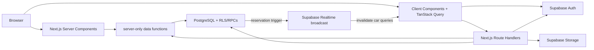

# Architecture and Project Structure

[Documentation index](README.md) · [Root README](../README.md)

## System Architecture

DriveReserve is a single Next.js App Router application backed by Supabase. Next.js owns pages, Route Handlers, server-side data access, validation orchestration, and browser UI. Supabase supplies identity, PostgreSQL, Storage, and Realtime.



## Frontend Architecture

Pages and layouts in `app/` are Server Components unless a file or imported boundary declares `"use client"`. Server Components are used for route composition, public catalogue/detail reads, metadata, and server-side access checks. Client Components own forms, filters, calendars, dialogs, URL state, responsive behavior, charts, toasts, and query-driven dashboards.

The root layout installs theme and TanStack Query providers. Reusable UI is layered as follows:

- `components/ui/`: shadcn/ui-style primitives.
- `components/common/` and `components/layout/`: shared headings, navigation, and footer.
- Domain components such as `components/cars/`, `components/reservation/`, `components/profile/`, and `components/admin/`.
- `features/`: query keys, request services, response schemas, hooks, and feature types.

Forms use React Hook Form with Zod-backed validation where appropriate. Sonner displays mutation feedback.

## Backend and Server-Side Architecture

Next.js Route Handlers under `app/api/` are the browser-facing backend. They:

1. Parse path, query, JSON, or multipart input.
2. Validate it with Zod.
3. Verify Supabase claims and the required application role.
4. Call a server data function, a Supabase table query, Storage, Auth, or a controlled PostgreSQL RPC.
5. Return a JSON success/error envelope or an Auth redirect.

Server-rendered pages do not call the application's own HTTP endpoints. Public pages call functions in `lib/server/cars/` and `lib/server/reservations/` directly, avoiding an unnecessary internal network hop.

`lib/server/` modules import `server-only` when they must never enter the browser bundle. The service-role Supabase client in `lib/supabase/admin.ts` is used only to read Auth email records for admin reporting; it is not a general data-access shortcut.

## Supabase Clients

| Module | Runtime | Purpose |
| --- | --- | --- |
| `lib/supabase/client.ts` | Browser | Auth state/password operations and Realtime channel subscriptions. |
| `lib/supabase/server.ts` | Server Components and Route Handlers | Cookie-aware user-scoped Supabase client. |
| `lib/supabase/proxy.ts` | Next.js Proxy | Refresh/propagate Auth cookies and perform optimistic route redirects. |
| `lib/supabase/admin.ts` | Server only | Service-role client for Supabase Auth admin email lookup. |

All application-table access remains subject to RLS unless the explicit service-role client is used.

## Rendering and Data-Fetching Strategies

| Area | Strategy |
| --- | --- |
| Landing page | Server-rendered page shell; featured cars load in a Client Component from `GET /api/cars/featured`. |
| `/cars` | Server Component reads URL search parameters and queries Supabase directly; Suspense streams result and filter sections. |
| `/cars/[id]` | Dynamic Server Component loads the car directly; related cars stream through Suspense; the booking card is interactive client UI. |
| Reservation confirmation | Dynamic Server Component validates query dates and fetches car/preview data; client UI continuously rechecks availability and submits the reservation. |
| Customer pages | Protected by the customer layout; page contents fetch Route Handlers with TanStack Query. |
| Admin list/dashboard pages | Protected client-driven shells using TanStack Query and Route Handlers. |
| Admin car edit | Server page loads the initial car through a server-only service; client form performs mutations through Route Handlers. |

The repository does not enable `cacheComponents`, declare `use cache`, set ISR `revalidate` values, or define `generateStaticParams`. API responses that contain current or private data generally send `no-store` headers, and browser services also use `cache: "no-store"` where relevant.

The current production build reports `/`, the four Auth pages, `/admin`, `/admin/cars`, `/admin/cars/new`, `/admin/customers`, and `/admin/reservations` as statically prerendered routes. The admin routes in that set are client-data shells, not public preloaded admin data. `/cars`, car detail/confirmation, all customer pages, and parameterized admin detail/edit pages are dynamically server-rendered. All Route Handlers are dynamic.

## TanStack Query and Realtime

TanStack Query manages public featured cars, reservation preview/calendar data, customer data, and admin dashboards/lists. Mutations update or invalidate domain-specific query keys.

Reservation availability has an additional cross-session path:

1. The `broadcast_reservation_availability_change` trigger runs after reservation insert, update, or delete.
2. `realtime.send` publishes `availability_changed` on `car:<uuid>:availability`.
3. `useReservationRealtime()` subscribes while a booking card or confirmation view is mounted.
4. The hook invalidates that car's availability and preview query subtree, causing active queries to refetch.

This is a Realtime Broadcast channel, not a `postgres_changes` subscription. Other admin/customer lists do not receive cross-browser pushes; they refresh through normal query invalidation, refetching, navigation, or reload.

## Validation and Error Handling

- Zod schemas in `lib/validations/` and feature schema files validate request bodies, dates, identifiers, filters, sorting, pagination, and client responses.
- Route Handlers return `{ success: true, data, message? }` or `{ success: false, error: { code, message, ... } }`; Auth callback handlers redirect instead of returning JSON.
- Server data functions normalize Supabase rows to camel-cased application shapes and throw or return typed failures.
- UI query services reject malformed or unsuccessful responses and surface retry/error states.
- PostgreSQL remains authoritative for role-sensitive reservation writes, state transitions, overlap protection, limits, and generated pricing fields.

## Important Repository Areas

```text
app/
  (auth)/                 Guest authentication and recovery pages
  (customer)/             Customer-only profile and reservation pages
  (public)/               Landing, catalogue, detail, and booking pages
  admin/                  Admin dashboard and management pages
  api/                    Auth, public, customer, and admin Route Handlers
components/               Reusable UI and domain presentation components
features/                 Client hooks, services, query keys, schemas, types
lib/
  server/                 Server-only auth and data-access functions
  supabase/               Browser/server/admin/Proxy clients
  validations/            Shared Zod request schemas
  cars/, reservations/    Domain filters and date utilities
public/                   Logo, auth artwork, and favicon assets
supabase/
  migrations/             Ordered PostgreSQL, RLS, RPC, Storage, Realtime SQL
  config.toml             Local Supabase configuration
  seed.sql                Development fleet rows
types/                    Generated database types and domain aliases
```

Route groups such as `(public)` do not appear in URLs. `proxy.ts` is the Next.js 16 replacement for the older `middleware.ts` convention.

[Previous: Project Overview](project-overview.md) · [Next: Setup and Configuration](setup-and-configuration.md)
