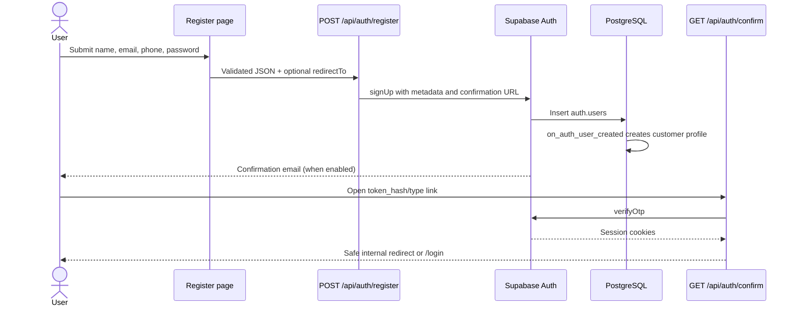
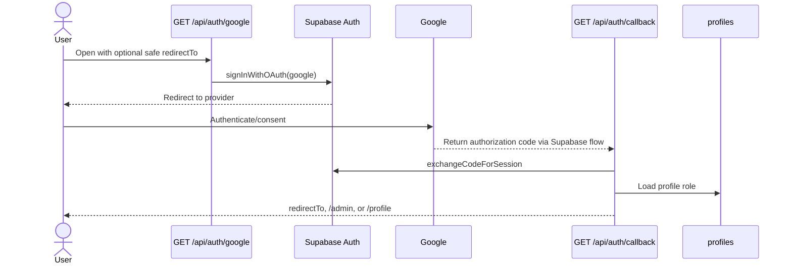
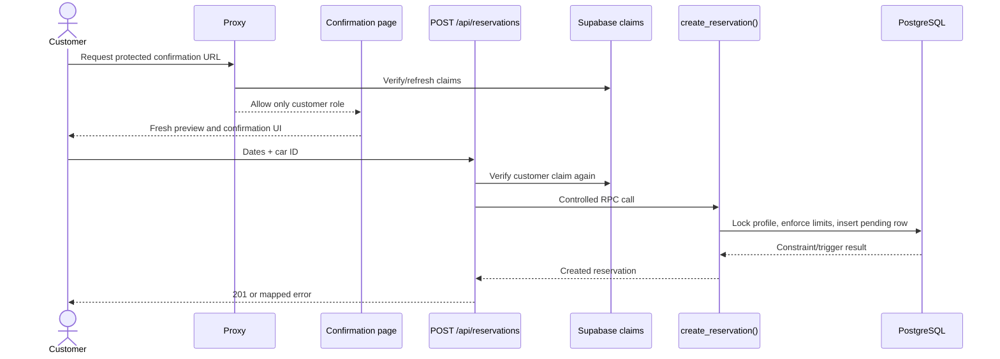

# Authentication and Authorization

[Documentation index](README.md) · [Root README](../README.md)

## Security Layers

DriveReserve deliberately separates three concerns:

| Layer | Question | Implementation |
| --- | --- | --- |
| Authentication | Is this a valid signed-in Supabase user? | Supabase Auth sessions; server-side `getClaims()` and selected `getUser()` checks. |
| Application authorization | May this role use this page/API operation? | `user_role` JWT claim, Next.js Proxy redirects, server layouts, and Route Handler role checks. |
| Database authorization | May this database identity read/write these rows? | PostgreSQL RLS, grants, `private.is_admin()`, and security-definer RPC checks. |

No one layer substitutes for the others. Proxy improves routing and session freshness, but protected APIs and the database enforce access again.

## Identity and Role Storage

Supabase Auth manages credentials, provider identities, email, verification state, and sessions in `auth.users`. `public.profiles` stores application name, phone, and `role`.

The `on_auth_user_created` trigger creates a profile after Auth registration. New users always receive the database default `customer` role; the registration request does not accept a role.

`public.custom_access_token_hook` reads the profile and adds `user_role: "customer" | "admin"` to new access tokens. The hook must be enabled in Supabase Auth configuration. Updating `profiles.role` does not rewrite an already-issued token, so the user must obtain a fresh token, normally by signing in again.

## Session Clients and Verification

- `lib/supabase/client.ts` creates the browser client.
- `lib/supabase/server.ts` creates a cookie-aware server client.
- `lib/supabase/proxy.ts` creates a Proxy client, verifies claims, refreshes sessions when necessary, and returns updated cookies to both Server Components and the browser.
- `getCustomerAccess()` and `getAdminAccess()` provide server-only verified role guards for layouts, handlers, and services.

Most authorization checks use `supabase.auth.getClaims()`, which verifies the access token. `GET /api/auth/me` additionally calls `getUser()` for the latest Auth record and confirms its ID matches the token subject. The implementation does not use `getSession()` as an authorization decision.

## Email and Password Registration

The route requires 8–72 character passwords even though checked-in local Supabase config has a lower six-character minimum. Email is normalized to lowercase; full name and optional phone are passed as Auth metadata for profile creation.

The application always returns `requiresEmailVerification: true`, but `supabase/config.toml` currently sets email confirmations to false. Hosted behavior depends on the project's Auth settings.

## Login and Logout

`POST /api/auth/login` validates email/password, calls `signInWithPassword()`, then loads the matching profile. It returns an explicit unverified-email error when Supabase rejects an unconfirmed account. If profile loading fails, the route signs the new session out to avoid leaving an incomplete authenticated state.

The login form preserves only a validated internal `redirectTo` path. After authentication, the UI/Proxy routes customers toward the requested route or customer area and admins toward `/admin`.

`POST /api/auth/logout` uses local-scope Supabase sign-out. Client hooks clear/invalidate relevant state and navigate away from protected UI. The navbar also listens to Supabase `onAuthStateChange` for browser session changes; that listener is Auth state handling, not a database Realtime subscription.

## Google OAuth

The Google provider and credentials are not configured in source control. They must be enabled in Supabase with provider/application callback allow-lists. If OAuth creates a new Auth user, the same Auth trigger creates its customer profile. The application does not store or display the Google profile image.

## Password Recovery and Reset

1. `/forgot-password` posts a validated email to `/api/auth/forgot-password`.
2. Supabase sends a recovery link targeting `/api/auth/recovery` at `NEXT_PUBLIC_SITE_URL` or the request origin.
3. The recovery handler requires `type=recovery`, verifies the token hash, establishes the recovery session, and redirects to `/reset-password`.
4. `/api/auth/reset-password` requires verified claims in that session, validates matching 8–72 character passwords, and calls `auth.updateUser()`.

Invalid/expired links return to the forgot-password page. Supabase rate limits and project email settings apply.

## Redirect Safety

`internalRedirectPathSchema` accepts only a path beginning with one `/`, rejects protocol-relative paths, backslashes, control characters, and any URL that resolves outside an internal sentinel origin. Auth handlers use `getSafeInternalRedirectPath()` before copying `redirectTo` into links or redirects.

Registration defaults its confirmation destination to `/cars`. OAuth callback defaults to `/admin` for admins and `/profile` for customers. Proxy login redirects preserve the originally requested pathname and query string.

## Route Protection

The root `proxy.ts` runs for application requests except Next.js/static image assets. It refreshes Auth cookies, reads the verified claim, and applies route groups defined in `lib/supabase/route-access.ts`.

### Public routes

- `/`, `/cars` and descendants.
- `/reset-password` because a recovery flow may already have an Auth session.
- The route table also lists `/about`, `/how-it-works`, `/unauthorized`, `/auth/callback`, and `/auth/confirm`; those page paths are not implemented. Actual Auth callbacks live under `/api/auth/*` and are allowed by the default-unclassified behavior.

### Guest-only routes

- `/login`
- `/register`
- `/forgot-password`

Authenticated admins are redirected to `/admin`; authenticated customers are redirected to `/cars`; an authenticated token without a recognized role is sent to `/unauthorized` (which is currently missing).

### Customer-only routes

- `/profile`
- `/my-reservations` and descendants
- `/cars/<one-segment-id>/confirm-reservation`

Guests are redirected to `/login?redirectTo=<requested path>`. Admins are redirected to `/admin`. The `(customer)` layout repeats the verified customer check on the server.

### Admin-only routes

`/admin` and all descendants. Guests go to login; non-admin sessions go to `/unauthorized`.

### API routes

API paths are not classified in the Proxy arrays and are therefore allowed through to their handlers. This is intentional for public/Auth endpoints and safe for protected endpoints only because customer/admin handlers independently verify claims and return `401`/`403`.

## Protected Reservation Creation

## Row Level Security and RPC Authorization

- Customers may select/update their own profile; column grants prevent role changes.
- Customers may select only their own reservations.
- Public users select only available cars and their image metadata.
- Admin policies allow full fleet/image access and all-profile/all-reservation reads.
- Normal users have no direct reservation write grants. Creation, cancellation, and admin status changes use security-definer functions with internal identity/role checks and explicit execution grants.
- Storage mutation policies call `private.is_admin()`.

See [Database](database.md#row-level-security) for the full policy summary.

## Security Considerations

- Keep `SUPABASE_SERVICE_ROLE_KEY` server-only. It bypasses normal RLS and is used only by the isolated Auth admin lookup client.
- Enable the custom access-token hook in every environment and force a new token after role changes.
- Configure exact production Site URL, email confirmation, recovery, and OAuth callback allow-lists.
- Do not rely on Proxy as the only authorization boundary; add explicit API classification/checks when creating new sensitive routes.
- Reservation rules remain in PostgreSQL so a modified browser or concurrent request cannot bypass them.
- Application logs currently include confirmation token hashes and uploaded `FormData` in two Route Handlers; remove or redact these logs before production use.

## Common Failure Cases

| Failure | Result |
| --- | --- |
| Missing/expired token | `401` from APIs or login redirect from protected pages. |
| Valid token without expected `user_role` | `403` or redirect to the missing `/unauthorized` page. |
| Custom token hook not enabled | Protected roles cannot be recognized. |
| Role changed while token remains active | Old authorization persists until token refresh/new sign-in. |
| Confirmation disabled locally | Registration may create a session/account without the expected verification step. |
| Callback not allow-listed | OAuth/confirmation/recovery redirect fails in Supabase. |
| Profile trigger/migration missing | Login/OAuth callback signs out or reports profile load failure. |
| Recovery link expired | Redirect to `/forgot-password?error=invalid-or-expired-link`. |

[Previous: API Reference](api-reference.md) · [Next: Technical Decisions](technical-decisions.md)
