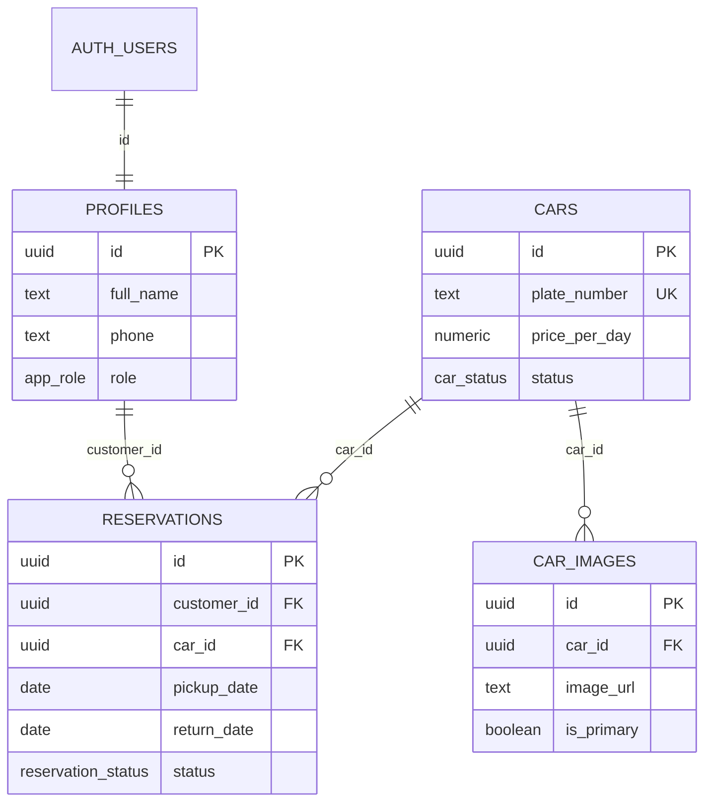

# Database

[Documentation index](README.md) · [Root README](../README.md)

## Overview

DriveReserve uses Supabase PostgreSQL. The application schema contains four public tables and links profiles one-to-one to Supabase-managed `auth.users`. Migrations also define enum types, RLS policies, Storage policies, transactional RPCs, lifecycle triggers, maintenance functions, and a Realtime broadcast trigger.



## Enum Types

| Enum | Values |
| --- | --- |
| `app_role` | `customer`, `admin` |
| `car_status` | `available`, `maintenance`, `inactive` |
| `reservation_status` | `pending`, `confirmed`, `active`, `completed`, `cancelled`, `rejected` |

`transmission` and `fuel_type` are constrained text columns rather than PostgreSQL enums. Supported values are `automatic`/`manual` and `petrol`/`diesel`/`hybrid`/`electric`.

## Tables

### `profiles`

One application profile per Supabase Auth user. `private.handle_new_user()` creates it after `auth.users` insertion.

| Column | Type | Nullable | Description |
| --- | --- | ---: | --- |
| `id` | `uuid` | No | Primary key and FK to `auth.users.id`; Auth deletion cascades. |
| `full_name` | `text` | No | Customer/admin display name; default empty string, maximum 100 characters. |
| `phone` | `text` | Yes | Optional phone, maximum 30 characters. |
| `role` | `app_role` | No | Trusted application role; defaults to `customer`. |
| `created_at` | `timestamptz` | No | Creation time. |
| `updated_at` | `timestamptz` | No | Updated automatically on row updates. |

### `cars`

Fleet catalogue and operational status.

| Column | Type | Nullable | Description |
| --- | --- | ---: | --- |
| `id` | `uuid` | No | Primary key, generated by `gen_random_uuid()`. |
| `brand` | `text` | No | Nonblank brand. |
| `model` | `text` | No | Nonblank model. |
| `year` | `integer` | No | Model year from 1900 through 2100. |
| `plate_number` | `text` | No | Nonblank plate; unique case-insensitively. |
| `color` | `text` | No | Nonblank display color. |
| `category` | `text` | No | Nonblank category. Application creation restricts it to `economy`, `compact`, `sedan`, `suv`, `luxury`, or `electric`. |
| `transmission` | `text` | No | `automatic` or `manual`. |
| `fuel_type` | `text` | No | `petrol`, `diesel`, `hybrid`, or `electric`. |
| `seats` | `smallint` | No | 1 through 20. |
| `price_per_day` | `numeric(10,2)` | No | Positive current daily price. |
| `description` | `text` | Yes | Optional description, at most 3,000 characters. |
| `features` | `text[]` | No | Display-only feature labels; defaults to an empty array. Current admin forms do not edit this column. |
| `status` | `car_status` | No | Defaults to `available`. Only available cars are public/reservable. |
| `created_at` | `timestamptz` | No | Creation time. |
| `updated_at` | `timestamptz` | No | Updated automatically. |

### `car_images`

Metadata for objects in the public `car-images` Storage bucket. `image_url` stores the object path, not a full URL.

| Column | Type | Nullable | Description |
| --- | --- | ---: | --- |
| `id` | `uuid` | No | Primary key. |
| `car_id` | `uuid` | No | FK to `cars.id`; car deletion cascades. |
| `image_url` | `text` | No | Nonblank Storage object path. |
| `is_primary` | `boolean` | No | Marks the primary image; defaults to `false`. |
| `display_order` | `integer` | No | Nonnegative ordering value; defaults to 0. |
| `created_at` | `timestamptz` | No | Creation time. |

A partial unique index permits at most one `is_primary = true` row per car. A car may have no primary image.

### `reservations`

Immutable booking facts plus lifecycle state.

| Column | Type | Nullable | Description |
| --- | --- | ---: | --- |
| `id` | `uuid` | No | Primary key. |
| `customer_id` | `uuid` | No | FK to `profiles.id`; deletion is restricted. |
| `car_id` | `uuid` | No | FK to `cars.id`; deletion is restricted. |
| `pickup_date` | `date` | No | First included rental day. |
| `return_date` | `date` | No | Exclusive end of the blocking range; must be after pickup. |
| `booking_period` | `daterange` | Technically yes | Stored generated `[pickup_date, return_date)` range; inputs make it non-null in normal rows. |
| `rental_days` | `integer` | Technically yes | Stored generated `return_date - pickup_date`. |
| `price_per_day_snapshot` | `numeric(10,2)` | No | Positive price captured at creation. |
| `subtotal` | `numeric(12,2)` | Technically yes | Stored generated days × price snapshot. |
| `total_price` | `numeric(12,2)` | Technically yes | Currently the same generated expression as subtotal; no fees/taxes table exists. |
| `status` | `reservation_status` | No | Defaults to `pending`. |
| `cancellation_reason` | `text` | Yes | Required when transitioning to `cancelled`; maximum 1,000 characters. |
| `rejection_reason` | `text` | Yes | Required when transitioning to `rejected`; maximum 1,000 characters. |
| `created_at` | `timestamptz` | No | Creation time. |
| `updated_at` | `timestamptz` | No | Updated automatically. |

## Indexes and Constraints

| Object | Purpose |
| --- | --- |
| `cars_plate_number_unique_ci` | Case-insensitive unique plate number. |
| `cars_status_idx`, `cars_category_idx`, `cars_brand_model_idx` | Common public/admin fleet filtering and ordering support. |
| `car_images_car_id_idx`, `car_images_display_order_idx` | Car image lookup and ordering. |
| `car_images_one_primary_per_car_idx` | Partial unique index enforcing at most one primary image. |
| Reservation customer, car, status, pickup, return, and customer/status indexes | Reservation lists and lifecycle queries. |
| `reservations_no_overlapping_car_rentals` | Partial GiST exclusion constraint preventing overlapping ranges for the same car while status is `pending`, `confirmed`, or `active`. |

Additional checks enforce nonblank car fields, valid year/transmission/fuel/seats/price, description/reason lengths, nonnegative image order, valid date ordering, and a positive reservation price snapshot. The `btree_gist` extension supports the mixed UUID/range exclusion constraint.

## Reservation Rules and Concurrency

All date calculations use Beirut's current calendar date where application/database rules require a business day boundary.

- Pickup must be after today.
- Return must be after pickup.
- Rental duration is at most 30 days.
- Pickup is at most 180 days ahead.
- A customer may hold at most five upcoming reservations in `pending`, `confirmed`, or `active`.
- A customer may have at most two such reservations covering any individual rental day.
- Only `pending`, `confirmed`, and `active` reservations block a car.
- One car cannot have overlapping blocking reservations.
- Only the owner may cancel, and only from `pending` or `confirmed`.

`create_reservation()` locks the customer's profile row with `FOR UPDATE`, preventing simultaneous requests from bypassing customer limits. Cancellation and admin status updates lock the reservation row. The GiST exclusion constraint is the final guard against two transactions booking the same car and period.

## Functions and RPCs

### Public/application functions

| Function | Caller | Responsibility |
| --- | --- | --- |
| `is_car_available(uuid,date,date)` | Anonymous/authenticated/service role | Boolean check for valid dates, available car status, and no blocking overlap. |
| `preview_reservation(uuid,date,date)` | Anonymous/authenticated | Returns availability, duration, price, total, and a reason code without writing. |
| `get_car_unavailable_ranges(uuid,date,date)` | Anonymous/authenticated/service role | Returns clipped blocking date ranges for at most 93 inclusive calendar days and flags ranges owned by the current user. |
| `create_reservation(uuid,date,date)` | Authenticated/service role | Customer-only transactional creation with price snapshot, limits, locking, and overlap handling. |
| `cancel_my_reservation(uuid,text)` | Authenticated/service role | Locks and cancels the caller's pending/confirmed reservation with a required reason. |
| `admin_update_reservation_status(uuid,status,text)` | Authenticated/service role | Admin-only locked status update; reason is used for cancellation/rejection. |
| `custom_access_token_hook(jsonb)` | `supabase_auth_admin` | Adds the trusted profile role as the `user_role` JWT claim. |

### Trusted maintenance functions

| Function | Behavior | Scheduling Status |
| --- | --- | --- |
| `reject_expired_pending_reservations()` | Rejects pending rows after 48 hours or when pickup begins in Beirut, whichever is earlier, and records an automatic reason. | Not scheduled in this repository. |
| `advance_reservation_statuses()` | Moves due confirmed rows to active and due active rows to completed; returns both counts. | Not scheduled in this repository. |

Execute these only from a trusted scheduler/role. No `pg_cron`, Edge Function schedule, or external job configuration is checked in.

### Private helper functions

| Function | Responsibility |
| --- | --- |
| `private.set_updated_at()` | Shared timestamp trigger implementation. |
| `private.handle_new_user()` | Creates a customer profile after Auth user creation. |
| `private.is_admin()` | Trusted role lookup used by RLS, Storage policies, and admin RPC authorization. |
| `private.validate_reservation_status_transition()` | Enforces state transitions and reason cleanup/requirements. |
| `private.broadcast_reservation_availability_change()` | Publishes targeted availability broadcasts after relevant reservation changes. |

## Lifecycle Trigger

`private.validate_reservation_status_transition()` enforces:

| From | Allowed To |
| --- | --- |
| `pending` | `confirmed`, `rejected`, `cancelled` |
| `confirmed` | `active`, `cancelled` |
| `active` | `completed` |
| `completed`, `cancelled`, `rejected` | No transition |

It requires a nonblank reason for rejection/cancellation and clears irrelevant reason columns for other statuses.

## Other Triggers

| Trigger | Event | Effect |
| --- | --- | --- |
| `profiles_set_updated_at` | Profile update | Sets `updated_at = now()`. |
| `cars_set_updated_at` | Car update | Sets `updated_at = now()`. |
| `reservations_set_updated_at` | Reservation update | Sets `updated_at = now()`. |
| `on_auth_user_created` | Insert into `auth.users` | Creates a customer profile from trusted Auth metadata. |
| `reservations_validate_status_transition` | Reservation status update | Enforces the state machine and reason rules. |
| `broadcast_reservation_availability_change` | Reservation insert/update/delete | Sends public `availability_changed` Realtime broadcasts for affected car topics; irrelevant updates are ignored. |

## Row Level Security

RLS is enabled on all four public tables.

| Table | Effective access |
| --- | --- |
| `profiles` | Authenticated users select/update their own profile; admins select all. Column grants limit normal updates to `full_name` and `phone`. |
| `cars` | Anonymous/authenticated users select `available` cars; admins select and mutate all cars. |
| `car_images` | Anyone may select image rows whose car is available; admins select/mutate all. |
| `reservations` | Customers select their own rows; admins select all. Direct normal-user writes are not granted; controlled RPCs perform writes. |

`private.is_admin()` checks the trusted profile row and is used by table and Storage policies.

The exact table policy names are:

| Table | Policies |
| --- | --- |
| `profiles` | `Users can view their profile`; `Admins can view all profiles`; `Users can update their profile`. |
| `cars` | `Anyone can view available cars`; `Admins can view all cars`; `Admins can create cars`; `Admins can update cars`; `Admins can delete cars`. |
| `car_images` | `Anyone can view images of available cars`; `Admins can view all car images`; `Admins can create car images`; `Admins can update car images`; `Admins can delete car images`. |
| `reservations` | `Customers can view their reservations`; `Admins can view all reservations`. |

## Storage

Migration `20260720164335_add_car_images_storage.sql` creates a public `car-images` bucket with a 5 MiB object limit and JPEG, PNG, and WebP MIME allow-list. Authenticated admins may list, upload, update, and delete objects through Storage policies. Public delivery is possible because the bucket is public.

The API stores paths in `car_images.image_url` and derives public URLs at read time. Uploads use `cars/<car-id>/<uuid>.<extension>` and allow at most six files per request.

Storage mutation/read-through-API policy names are `Admins can view car images`, `Admins can upload car images`, `Admins can update car images`, and `Admins can delete car images`.

## Migration Workflow

Create a new migration rather than editing an already-shared migration:

```bash
supabase migration new descriptive_name
supabase db reset
```

For a linked hosted project:

```bash
supabase db push
```

After schema changes, regenerate `types/database.types.ts` with the project's normal Supabase type-generation workflow and review the diff. The checked-in generated types currently omit `advance_reservation_statuses()` and the private Realtime trigger function added by later migrations; application table shapes are otherwise consistent with the migrations inspected.

[Previous: Setup and Configuration](setup-and-configuration.md) · [Next: Features and Workflows](features-and-workflows.md)
