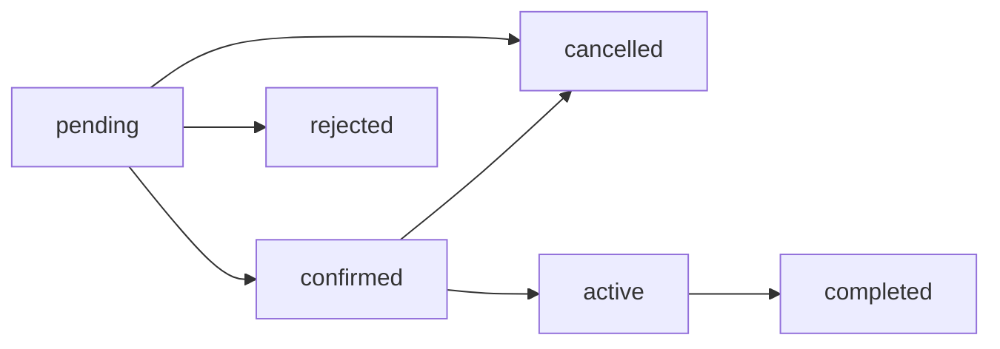

# Project Overview

[Documentation index](README.md) · [Root README](../README.md)

## Project and Purpose

DriveReserve is a car-rental reservation application. It centralizes public fleet discovery, customer booking activity, and administrator operations in one Next.js and Supabase system.

The project addresses three connected needs:

- Visitors need current vehicle information and date availability before creating an account or booking.
- Customers need a controlled way to request rentals, track status, maintain their profile, and cancel eligible reservations.
- Administrators need one workspace for fleet records, car images, customers, reservation decisions, and operational indicators.

## Target Users and Roles

| User | Access | Responsibilities |
| --- | --- | --- |
| Visitor | Public pages and public availability APIs | Browse cars, filter the catalogue, inspect details, and preview dates and price. |
| Customer | Public pages plus protected customer pages | Create reservations, view reservation history/details, cancel eligible bookings, and update profile details. |
| Administrator | Protected `/admin` pages and admin APIs | Manage cars and images, review and transition reservations, inspect customers, and use dashboard reporting. |

Application roles are stored in `public.profiles.role` as `customer` or `admin` and copied into the `user_role` access-token claim by `public.custom_access_token_hook`.

## Main Capabilities

- Public landing page and available-car catalogue.
- Search by brand, model, or category; category, transmission, fuel, seats, and price filters; sorting and pagination.
- Vehicle details with ordered images, specifications, features, related cars, and a reservation calendar.
- Server-validated reservation previews with snapshot pricing.
- Email/password registration, confirmation callback support, login, logout, recovery, reset, and Google OAuth.
- Customer reservation history, detail, cancellation, profile editing, and rental counts.
- Admin dashboard, fleet CRUD-style management, image management, reservation operations, and customer directory.
- PostgreSQL-enforced date, usage, concurrency, ownership, and state-transition rules.

## Reservation Lifecycle

1. A visitor selects a generally available car and a valid date range.
2. The application requests a server-side price and availability preview.
3. A signed-in customer acknowledges the reservation policy and submits the booking.
4. `create_reservation()` performs role, date, limit, price, and overlap checks and creates a `pending` row.
5. An administrator may confirm or reject a pending reservation. A rejection requires a reason.
6. A confirmed reservation may become `active`, then `completed`; pending or confirmed reservations may be cancelled with a reason.

`completed`, `rejected`, and `cancelled` are terminal. The database trigger `reservations_validate_status_transition` is authoritative.

## Current Scope

The implemented scope covers reservation requests and operational status management. Revenue shown in the admin dashboard is derived from completed reservation totals; there is no payment ledger or payment-provider integration.

Customer records are read-only from the admin UI. The repository also contains no billing, invoicing, damage inspection, pickup-location management, notifications service, or native mobile application.

The database contains maintenance functions for expiring unreviewed pending reservations and advancing due rentals, but the repository does not schedule them. They must be invoked by a trusted external scheduler to run automatically.

## Overall User Journey

A user arrives at the landing page, browses the catalogue, opens a car, chooses dates, and receives a live availability-aware estimate. Authentication is required before the confirmation route can be used. After creation, the customer follows the reservation from the customer area while administrators review and progress it from the admin workspace. Database rules and Realtime availability broadcasts keep competing booking attempts consistent and prompt open booking views to refetch car availability.

[Next: Architecture and Project Structure](architecture-and-project-structure.md)
